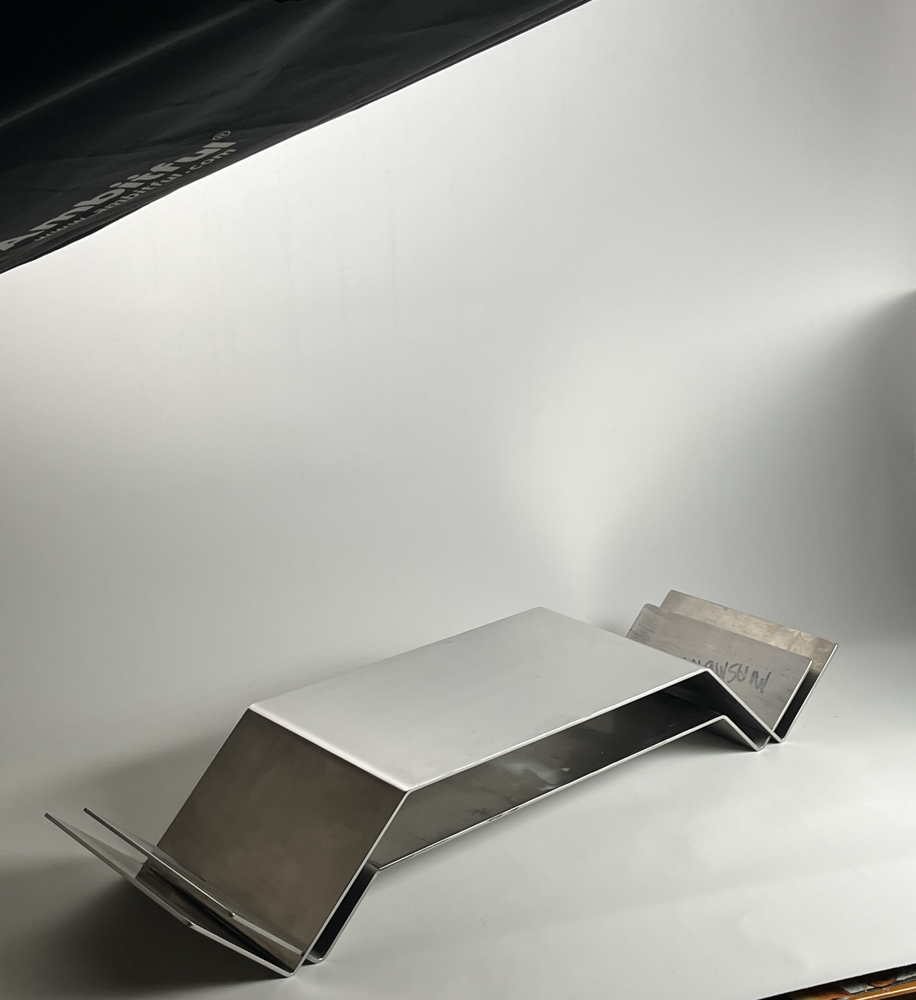
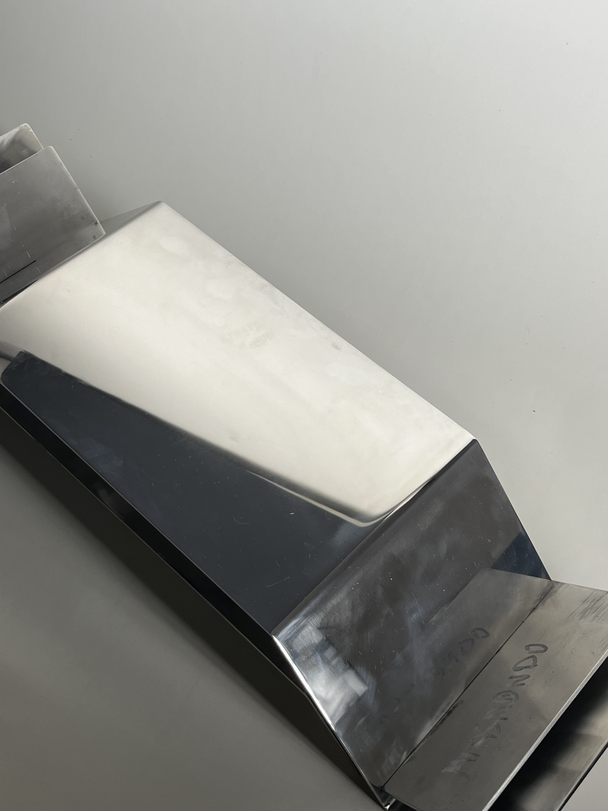

# MASYW

A product showcase website for a design studio specializing in monolithic stainless steel furniture and objects. Built as a modern, responsive single-brand e-commerce frontend.




## About the project

MASYW is a brand founded by a friend from southern Poland — a design studio crafting heavy, industrial furniture from stainless steel. I'm helping him build the website, which presents their product catalog with detailed specifications, an image gallery, and integrated contact forms. I also contributed to the overall visual design of the site.

### Key features

- **Dynamic product pages** with image galleries, specs, and pricing
- **Contact form** with client & server-side validation (Zod + React Hook Form)
- **Server Actions** for form handling (no separate API layer)
- **Responsive design** with mobile-first approach and animated hamburger menu
- **Smooth scroll navigation** and CSS scroll-driven animations
- **SEO-ready** with metadata API and robots.ts configuration
- **Optimized media** — Next.js Image component with lazy loading

## Tech stack

| Category  | Technology                                                                |
| --------- | ------------------------------------------------------------------------- |
| Framework | [Next.js 16](https://nextjs.org/) (App Router)                            |
| Language  | [TypeScript](https://www.typescriptlang.org/) (strict mode)               |
| Styling   | [Tailwind CSS 4](https://tailwindcss.com/)                                |
| Forms     | [React Hook Form](https://react-hook-form.com/) + [Zod](https://zod.dev/) |
| Linting   | ESLint + Prettier (with Tailwind plugin)                                  |

## Project structure

```
masyw/
├── app/
│   ├── layout.tsx          # Root layout (Navbar + Footer)
│   ├── page.tsx            # Home — hero video, description, product grid
│   ├── about/page.tsx      # Brand story
│   ├── contact/page.tsx    # Contact info + form
│   ├── products/[id]/      # Dynamic product detail pages
│   ├── api/action.ts       # Server action for form submission
│   └── robots.ts           # SEO configuration
├── components/
│   ├── Hero.tsx            # Video background with scrolling text
│   ├── ProductList.tsx     # Product grid
│   ├── ProductDetails.tsx  # Single product view with form toggle
│   ├── contactForm.tsx     # Validated contact form
│   ├── Navbar.tsx          # Responsive navigation
│   ├── Footer.tsx          # Footer with scrolling marquee
│   └── Description.tsx     # Homepage description section
├── data/
│   ├── products.ts         # Product catalog + Product type
│   ├── about.ts            # About page content
│   └── contact.ts          # Contact details
└── public/                 # Static assets (images, video)
```

## Getting started

### Prerequisites

- Node.js 18+
- npm

### Installation

```bash
git clone https://github.com/wojtek-smyczek/masyw.git
cd masyw
npm install
```

### Development

```bash
npm run dev
```

Open [http://localhost:3000](http://localhost:3000) in your browser.

### Build

```bash
npm run build
npm start
```

## License

© MASYW. All rights reserved.
